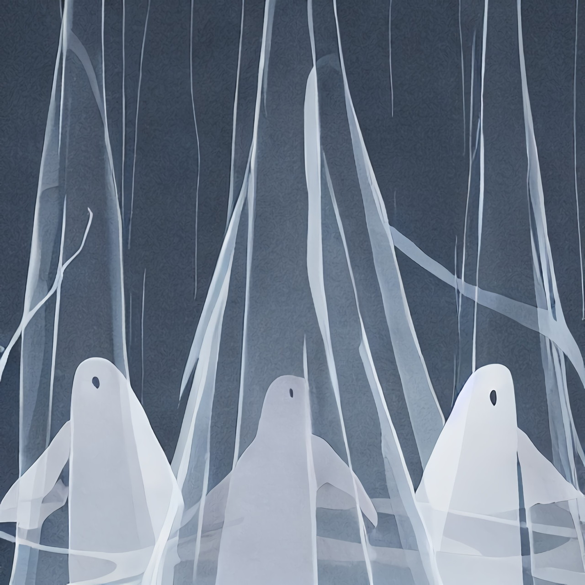
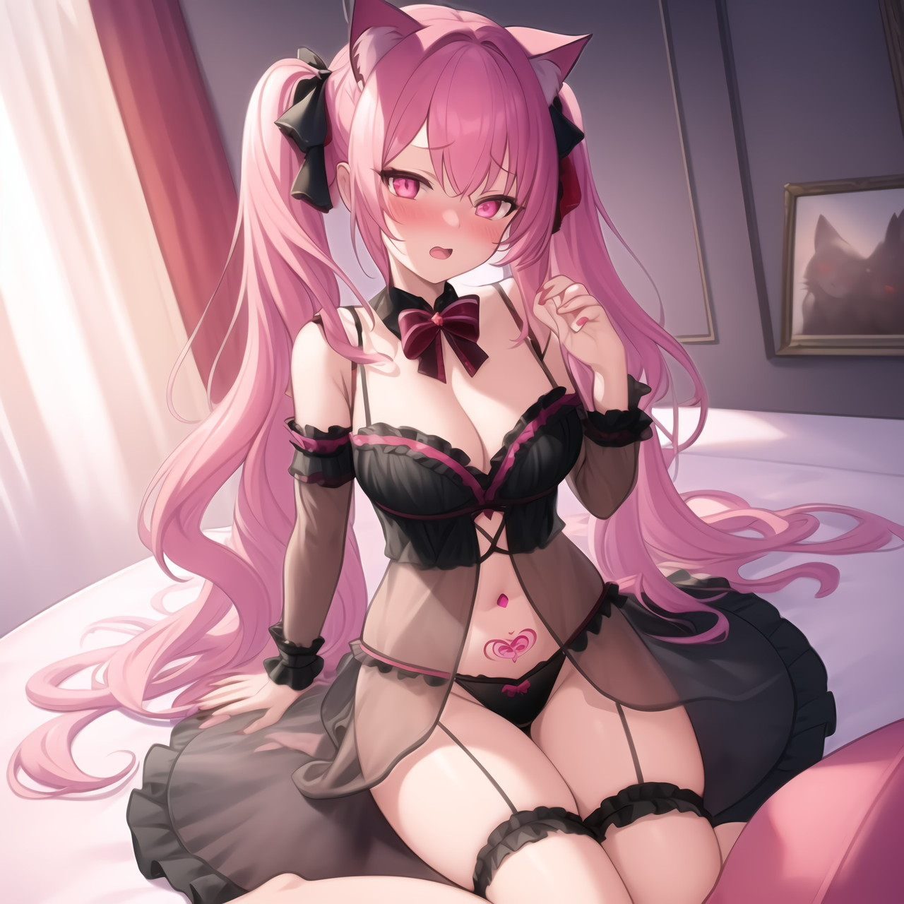
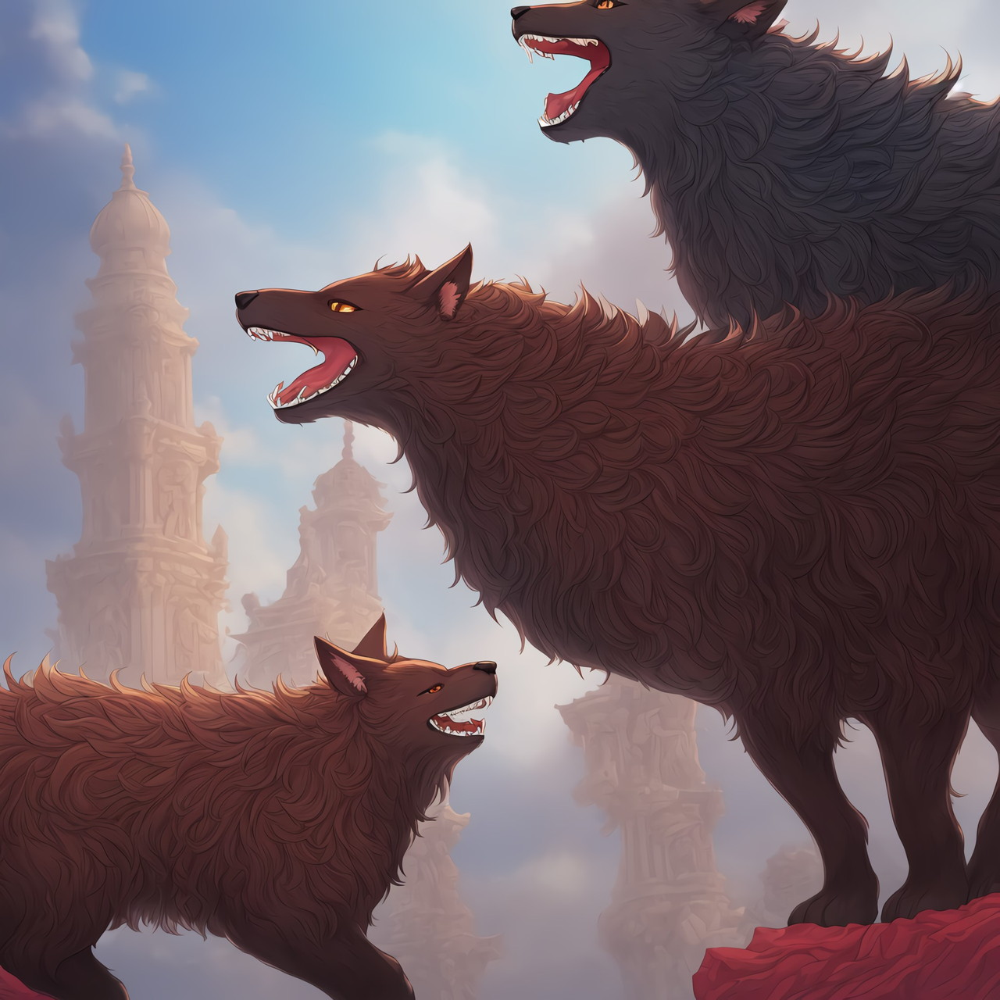
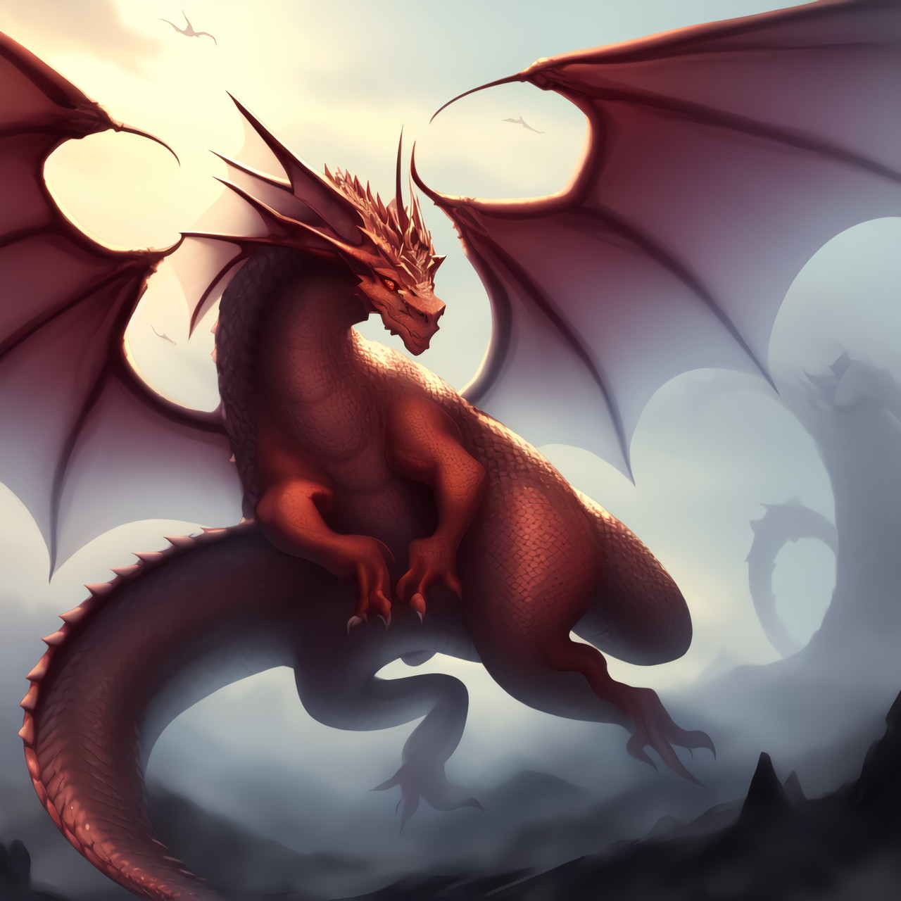

ファンタジーAI絵図鑑 ver0.1
　当書籍はweb連載『ファンタジー初心者用語解説』を再編集したものです。
　正方形の画像を採用し、上下に文字が入る仕様になっており、スマートフォンなどの縦長の画面で見ることを前提としていることにご注意ください。
　英語名の後の丸括弧の数字は有名度をだいたいで示します。
# ■sec 1.魔物
　魔物、モンスター、MOBなどについて取り上げます。
　AIイラストによる物量で挿絵を入れたのでイメージの参考になると幸いです。
　ただしこの絵以外にも一般的な見た目の選択などがあるので注意してほしいです。
　比較的有名な物を選んで掲載していますが、今回未掲載のこれ以外にも有名なものもいくつかあります。

=====

## ◆1.スライム

　slime(10)半透明のゲル状の魔物。スライムは最弱とされることもあるが、剣が効きにくかったりして強いこともある。死んだ魔物や動物を丸ごと取り込み消化してしまう。

=====

## ◆2.アルミラージ

　almiraj(7)角ウサギ、一角ウサギ。ホーンラビット。一本角の生えたウサギ。赤目白毛が一般的。

=====

## ◆3.アルラウネ

　alraune(2)アラウネ。マンドラゴラのドイツ語。女神や植物の女性型精霊として出てくる。ドリアードに近い感じ。

=====

## ◆4.コボルト

　kobold(8)コボルド。非常に弱いとされる背が低い犬の頭を持つ人型の魔物。全身毛がフサフサのようだ。簡単なナイフなどの武器を持つ。魔法使いのイメージはない。

=====

## ◆5.ゴブリン

　goblin(9)小型の醜い人型の魔物。弱い。不潔なイメージ。コボルトよりはガッチリしている。肌の色は緑色が多いようだ。鼻や耳が尖っていて禿げ頭で目つきが悪い。ゴブリン戦士のほかに魔法使いやがっちりした中ボスなどの派生がいる。亜人扱いで人族と友好的な場合もある。

=====

## ◆6.オーク

　orc, ork(8)(オークの木：oak)。背丈は人よりやや高く醜い人型の魔物。わりと弱いが序盤ではちょっと強い。豚の頭のこともある。イノシシのような牙が口元に生えている。色は緑やピンクが多い。お腹が出てるデブ。

=====

## ◆7.オーガ

　ogre(7)人型の魔物。鬼。人食いのちょっと巨人。角が生えてる。マッチョ戦闘狂。

=====

## ◆8.トロール

　troll(6)トロル。人型の魔物。巨人。オーガよりも大きいイメージ。太っており動きは鈍く、知能が低い。固い。

=====

## ◆9.ハーピー

　harpy(5)ハルピュイア。ハーピィ。顔と体が人の鳥。手はなく翼がある。足は鳥の足。亜人扱いで人族と友好的な場合もある。だいたい女性。主に白・ピンク系と黒・茶色系がある。

=====

## ◆10.セイレーン

　siren(6)セイレン。上半身は女性、美女で鳥の翼が生えている。中世以降、下半身は魚で人魚とされる。魅了の歌を歌い、船乗りを惑わすとされる。笛やハープを演奏することも。一般的にはハーピーと混同されることもあり設定が混ざっていることも。警報器、サイレンの語源。

=====

## ◆11.ガーゴイル

　gargoyle(4)ガルグイユ。石でできたカラス、コウモリ、竜、猛禽類風の魔物。わりと強い。空を飛ぶことができる。ゴーレムよりは小型。門番や偵察兵としてのイメージが強い。

=====

## ◆12.ロック・ゴーレム

　rock golem(6)ゴレム。大型の人型の石・鉱物などでできた魔物。わりと強い。人型であるとは限らない。魔法耐性があったりする。ゴーレムは人が使役している場合もある。

=====

## ◆13.オリハルコン・ゴーレム

　orichalcum golem(6)他にもウッド・ゴーレム、サンド・ゴーレム、ストーン・ゴーレム、アイアン・ゴーレム、ミスリル・ゴーレム、プラチナ・ゴーレム、ゴールド・ゴーレムなど材料による多様な種がある。

=====

## ◆14.サイクロプス

　cyclops(4)キュクロープス。一つ目の巨人。イメージ的には赤い目、灰色系の皮膚などをしている。

=====

## ◆15.ローパー

　roper(1)ロープっぽいもの。たぶんイソギンチャクみたいな触手生物。触手はテンタクルなのでそういう名前のモンスターもよく出てくる。

=====

## ◆16.トレント/エント

　torrent(4)、ent(6)動く巨木のモンスター。精霊として扱われることもある。どちらかというとエントのほうが精霊、木人っぽい。エントは指輪物語由来で版権回避のための名前がトレント。

=====

## ◆17.マンイーター

　man eater(5)食人植物。ウツボカズラ系とハエトリグサ系がある。ツルなどが触手みたいになっていて縛りつけてくることもある。「人を喰うモノ」というアンデッド系や得体のしれないモノの場合もある。

=====

## ◆18.雪の女王

　snow queen(8)氷などでできた女王で氷魔法で攻撃してくる。映画とかでも有名。

=====

## ◆19.ゴースト

　ghost(8)幽霊。実体のない人の霊魂などを指す。白ぽくて足が無くて浮いている感じなのは洋の東西を問わないようだ。

=====

## ◆20.レイス

　wraith(6)生霊、死霊、亡霊、幽霊。ゴーストより女性キャラっぽさがなんとなくある。妖精一覧にもあるが、こちらの絵はモンスター風となっている。

=====

## ◆21.スケルトン

　skeleton(8)動く骸骨。基本的には人型の全身骸骨で、武器や盾を持っていることが多い。ドラゴンスケルトン(スカルドラゴン)などもたまに登場する。

=====

## ◆22.ミイラ

　マミー/mommy(8)動くミイラ。全身を包帯で巻いている埋葬された死体。モンスターの場合は二本足で歩く。しばしば赤い光る目をもつ。包帯を飛ばして攻撃してくる。

=====

## ◆23.デュラハン

　dullahan(6)首なしの騎士。全身鎧で首は手で抱えて持っている。男性だったり女性だったりまちまち。鎧の中は空洞だったりする。首なし馬のコシュタ・バワー/koshta bowerに乗っていたり、馬車を引かせていることがある。

=====

## ◆24.リッチ

　lich(5) (×：rich/裕福な)D&Dに登場する魔術師のスケルトン。非常に強いとされる。商標の関係で、名称の使用を敬遠することが多い。

=====

## ◆25.ノーライフキング

　no life king(4)究極のヴァンパイア。不死者の王。リッチの代用品ボス。ただし元ネタの題名の小説・映画があるため、この名称も避けることがある。

=====

## ◆26.ヴァンパイア

　吸血鬼/vampire(10)昼間活動できない種をナイトウォーカー逆はデイウォーカーという。以下のものに弱い。日光、ニンニク、十字架、銀、流れる川。霧になれる。コウモリを眷属とする。背中にコウモリ風の羽があり空を飛べる。棺桶で眠る。心臓に杭を打たれると死ぬ。牙がある。鏡に映らない。血の代用にトマトジュースを飲む。ドラキュラは個人名で史実の人物。

=====

## ◆27.サキュバス

　夢魔/succubus(8)悪魔の一種。女性。男性版はインキュバス/incubus(4)という。睡眠中に襲い精力を奪う。

=====

## ◆28.ケルベロス

　cerberus 等(6)犬の魔物。地獄の門番。頭が三つある。甘いものが好きで音楽を聴くと寝る。

=====

## ◆29.オルトロス

　orthoros(3)ケルベロスの兄、犬の魔物。体毛は黒で頭が二つある。

=====

## ◆30.キメラ

　chimera(8)合成獣をキメラまたはキマイラ/chimera(6)と呼ぶ。キメラという固有の種の場合もある。合成獣をキメラ、固有の魔物をキマイラと呼び分ける場合もある。ギリシャ神話のキマイラは、ライオン、ヤギ、ヘビ(ドラゴン)の合成獣らしい。

=====

## ◆31.マンティコア

　manticore(4)ライオンだかサルだかそんな感じのやつ。人食いであるとされる。しっぽに毒針がある。

=====

## ◆32.バシリスク/コカトリス

　basilisk/cockatrice(5)コカトリスと同一。ヘビかトカゲか鳥のような魔物。毒や石化攻撃をしてくる。鳥から鶏の連想でよく唐揚げにされる。

=====

## ◆33.グリフォン

　griffon(8)グリフィン、グリプス、グリュプス。ワシの上半身と翼にライオンの下半身の魔物。騎獣にされ紋章とかにもよく登場する。関連にヒッポグリフというグリフォンとメス馬のハーフがあり、グリフォンより騎乗に適するとされる。

=====

## ◆34.ミノタウロス

　minotaur(6)牛頭の人型の魔物。筋肉ムキムキ。友好的な場合もある。

=====

## ◆35.ケンタウロス

　centaur(6)下半身が馬の首より下で、その上に人の上半身が載っている半人半獣。人語を話せるので獣人扱いが多く、あまり魔物としては登場しない。なお星座名は「ケンタウ【ル】ス座」となっている。女性はケンタウレという。

=====

## ◆36.オウルベア

　owl bear(2)アウルベア。頭がフクロウのクマ。

=====

## ◆37.メデューサ

　medusa(6)髪の毛が蛇の女。メデューサに睨まれると石になってしまう。

=====

## ◆38.スキュラ

　scylla(2)上半身が女性、下半身が触手、タコ。モンスター娘。

=====

## ◆39.クラーケン

　kraken(5)巨大イカ。沖合で船を襲うとされる。

=====

## ◆40.サハギン

　sahagin(5)半魚人。扁平の魚顔、目が魚眼、首の付け根にエラ、背中にヒレ、手足に水かき、手足体は人間に近い。

=====

## ◆41.ヒュドラ

　hydra(5)ハイドラ。頭が5から9程度ある魔物。蛇っぽい。ウミヘビ座のこと。下級の竜扱いであることも多い。血に毒があり、首は再生するとされる。ヤマタノオロチに似ている。

=====

## ◆42.ワーム

　sand worm(5)(×：warm/暖かい)ウォーム。元の意味は竜だったが、近年では巨大ミミズのような物が多いらしい。翼はあったりなかったりする。砂に潜って活動するサンドワームが多い。

=====

## ◆43.サーペント

　serpent(6)蛇系の魔物。海蛇シーサーペント等。ドラゴンより下位の竜としてよく出てくる。

=====

## ◆44.ワイバーン

　wyvern(7)亜竜。飛竜。竜の弱い系。手がない翼竜のようなイメージであることが多い。竜騎士ワイバーンライダーといって、騎獣にすることがある。唐揚げにもする。

=====

## ◆46.ドレイク

　drake(5)画像は地竜/アースドレイク。ドラゴンの一種、下級竜とされることが多い。語源はドラゴンと同じ。なかでも伝承ファイア・ドレイクはその名の通り、火竜らしい。

=====

## ◆47.ドラゴン

　dragon(10)言わずと知れたドラゴン。かなり大きい。手と足、コウモリ風の羽にしっぽがある。長寿で空を飛び火を吐き、賢いものは言葉を理解する。山の頂上や火山の火口などに棲む。羽以外を鱗が覆っている。逆燐が弱点。

=====

## ◆47.魔王

　the Devil、archenemy(10)画像は魔王ちゃん。ボス。強い。よく角が生えている。すごく大きかったり幼女だったりする。

=====

## ◆48.天使

　エンジェル/angel(10)魔物ではないがゲームによっては敵として出てくることもある。白い羽、天使の輪、金髪碧眼白い服などが定番。ピンク、青、黒い服などを着ている子もいる。

======

# ■sec 2.妖精
　妖精、精霊、フェアリー、スピリット、スプライトなどについて取り上げます。

=====

## ◆49.妖精、精霊

　フェアリー/fairy(10)、スピリット/spirit(6)妖精は小さくて耳が長く二対四枚の蝶のような羽。水の妖精は「妖精の泉」によく住んでいる。「妖精光」という妖精が出す光があるとされる。

=====

## ◆50.ニンフ

　nymph(3)ギリシャ語でニュンペー。ギリシャ神話の樹、山、海、川など自然を象徴した妖精、下級女神。

=====

## ◆51.サラマンダー

　salamander(8)属性の精霊のことをエレメンタルと呼ぶ。火の精霊、エレメンタル。よく火トカゲまたはドラゴンとしてデザインされている。ただしsalamanderはサンショウウオの意味でもある。

=====

## ◆52.ウンディーネ

　undine(7)水の精霊、エレメンタル。水でできた女性、女神風によくデザインされる。フランス語でオンディーヌ。水の精霊としてはウンディーネ表記が多いが、他の要素、地名国名などとしてオンディーヌが出てくることも結構ある。

=====

## ◆53.シルフ

　シルフィー/sylph(7)シルフィード/sylphide(5)風の精霊、エレメンタル。風をまとった女神風によくデザインされる。

=====

## ◆54.ノーム

　gnome(7)土の精霊、エレメンタル。gnomeと書くが英語ではgは発音しないのでグノームとは言わない(ギリシャ語などは除く)。

=====

## ◆55.ジン

　jinn(8)(×：gin/お酒)アラブの精霊や魔人のこと。アラジンと魔法のランプが有名。

=====

## ◆56.イフリート

　ifrit(6)炎のジン。サラマンダーの代わりに火の精霊に使われることもある。

=====

## ◆57.スプリガン

　spriggan(2)ドワーフのような妖精。

=====

## ◆58.レプラコーン

　leprechaun(2)ドワーフのような妖精その二。

=====

## ◆59.ノッカー

　knocker(5)鉱山に住む妖精、スプラウト。

=====

## ◆60.インプ

　imp(2)妖精だったが悪魔でもある。

=====

## ◆61.グレムリン

　gremlin(7)映画グレムリンがあまりにも有名。逆にそのイメージで使いにくい。

=====

## ◆62.ブラウニー

　brownie(4)家を掃除してくれる妖精。

=====

## ◆63.ピグミー

　pygmy(6)小人。現実世界の民族の総称として使われているため、ポリコレ的に現代のファンタジーでは架空種族名として使用することを、わりあい忌避される。

=====

## ◆64.ドリアード

　dryad(5)ドライアド。木の精霊。ニンフ。木に宿り森などに住んでいる。葉っぱや花をモチーフにした少女型が多い。アルラウネが多少近い。

=====

## ◆65.エルフ

　elf(複：elves)(9)亜人だが妖精として扱われることもある。エルフ耳、金髪碧眼。

=====

## ◆66.オベロン

　oberon(5)エルフの妖精王。

=====

## ◆67.ティターニア

　titania(4)妖精の女王。オベロンの妻。

=====

## ◆68.ドワーフ

　dwarf(複：dwarves)(8)亜人だが妖精として扱われることもある。エルフ耳、小人。特に近年、女性は幼女とされる。

=====

## ◆69.ケットシー

　cait sith(6)(×：ketsy)猫の妖精。猫耳、猫尻尾。妖精の国に住んでいる。もっと猫顔で描かれることもある。

=====

## ◆70.クーシー

　cu sith(5)犬の妖精。犬耳、犬尻尾。妖精の国に住んでいる。もっと犬顔で描かれることもある。

=====

## ◆71.バンシー

　banshee(4)女性型の悪霊アンデッドまたは妖精。

=====

## ◆72.レイス

　wraith(6)生霊。幽霊みたいな存在。アンデッドの一種。こちらでは少女風のキャラとして扱う。

=====

## ◆73.ウィル・オ・ウィスプ

　will o' the wisp(3)火の玉。鬼火。幽霊系、または精霊。

=====

## ◆74.ヘルハウンド

　hell hound(6)黒い犬の幽霊、妖精。黒い炎や霧などをまとう。

=====

## ◆75.キューピッド

　cupid(10)裸の金髪の子供。背中に天使の羽。手に弓矢、ラッパ。服を着ているなら白いワンピースが多い。髪は他に茶色、ピンクなど。心にハートの矢を刺して恋を叶えるとされる。天使とよく一緒くたにされる。

======

# ■sec 3.幻獣
　幻獣、聖獣、霊獣、神獣などと呼ばれるグループについて記述します。

=====

## ◆76.カーバンクル

　carbuncle(7)額に「赤い」ルビー系の宝石が付いている大きめのリスのような幻獣。体毛はたぶん白か茶色が多い。

=====

## ◆77.ユニコーン

　unicorn(9)イッカクの角が付いた白い馬。処女しか認めない。角は霊薬の材料になるといわれる。

=====

## ◆78.バイコーン

　bicorn(4)角が二つあるユニコーン。黒い。ユニコーンが純潔、バイコーンが不純をつかさどる。

=====

## ◆79.ペガサス

　天馬/pegasus(9)鳥の翼が生えた白い馬。空を飛べる。なお星座名は「ペガ【ス】ス座」となっている。

=====

## ◆80.スレイプニル

　sleipnir(5)八本足の軍馬の神獣。とても速い。

=====

## ◆81.フェンリル

　fenrir(6)巨大な狼。灰色、白、水色系統の色をしてることが多い。

=====

## ◆82.<ruby>麒麟<rt>きりん<rt></ruby>

　qilin/kirin/kyilin(10)中国の霊獣。馬に似て金色の<ruby>鬣<rt>たてがみ<rt></ruby>、鹿のような角を持つ。オスを麒、メスを麟と呼ぶ。五霊のひとつ、方角は中央。黄龍。千里を1日で駆ける。空を飛ぶ。五神は古くは麒麟ではなく黄龍だった。

=====

## ◆83.黒麒麟

　black qilin/kirin/kyilin(7)黒い麒麟。五行になぞらえ黄を麒麟といい色によって青を<ruby>聳孤<rt>しょうこ<rt></ruby>、赤を<ruby>炎駒<rt>えんく<rt></ruby>、白を<ruby>索冥<rt>さくめい<rt></ruby>、黒を<ruby>角端<rt>かくたん<rt></ruby>とそれぞれいう。

=====

## ◆84.フェニックス

　不死鳥/phoenix(9)火をまとった鳥。死んで灰になってもまた復活する。中国の<ruby>鳳凰<rt>ほうおう<rt></ruby>と同一視されることもあるが、厳密には異なるらしい。

=====

## ◆85.リヴァイアサン

　leviathan(6)海中に棲む竜の一種。最強の生物。海のリヴァイアサン、陸のベヒモス、空のジズでセットとして三頭一対とされる。世界の終末にはこの3種は食料にされるらしい。元々はジズなしで二頭一対とされた。

=====

## ◆86.ベヒモス

　behemoth(6)ベヒーモス。絵は猫バージョン。陸に棲むカバやゾウのような巨大な獣。最高の生物。元々はバハムート(8)と同一だったが現代のゲームの多くではバハムートは竜として書かれ別もの扱いされることもある。

=====

## ◆87.ジズ

　ziz(5)(×：jizz)巨大な鳥。シルエットは白鳥風が多い気がする。

=====

## ◆88.アスピドケロン

　aspidochelone(4)海に棲む巨大な蛇亀。島のような大きさ。

=====

## ◆89.ガルダ

　garuda(5)ガルーダ。インド神話の神鳥。風の精霊の上級として出てきたりする。

=====

## ◆90.ナーガ

　naga(3)インド神話の神竜。上半身人、下半身蛇らしい。よくモンスターやナーガ族という種族として出てきたりする。

=====

## ◆91.ヴリトラ

　vritra(3)インド神話の蛇の怪物、神っぽい何か。よく竜の姿で描かれる。

=====

## ◆92.ウロボロス

　ouroboros(5)自らの尻尾を咥えて円になっている蛇または竜。

======

# ■sec 4.UMA
地球上にいる未確認生物を総称してUMAなどといいます。
たまにファンタジー世界でも魔物などとして登場します。
ここではいくつかを紹介します。

=====

## ◆93.イエティ

　yeti(8)雪男。多くの場合は白毛。

=====

## ◆94.ビッグフット

　bigfoot(7)雪男。多くの場合は黒毛。

=====

## ◆95.ネッシー

　nessie(8)イギリス、ネス湖に棲むむとされる首長海竜。

=====

## ◆96.チュパカブラ

　chupacabra(6)なんか緑色の謎の生物。人型。

=====

## ◆97.スカイフィッシュ

　skyfish(5)空飛ぶ魚。

=====

## ◆98.ツチノコ

　tsuchinoko(7)太くて短い蛇みたいなやつ。日本。

=====

『ファンタジーAI絵図鑑 ver0.1』epub版
　著者：滝川　海老郎
　
　2023年 2月13日　初版 ver0.1
